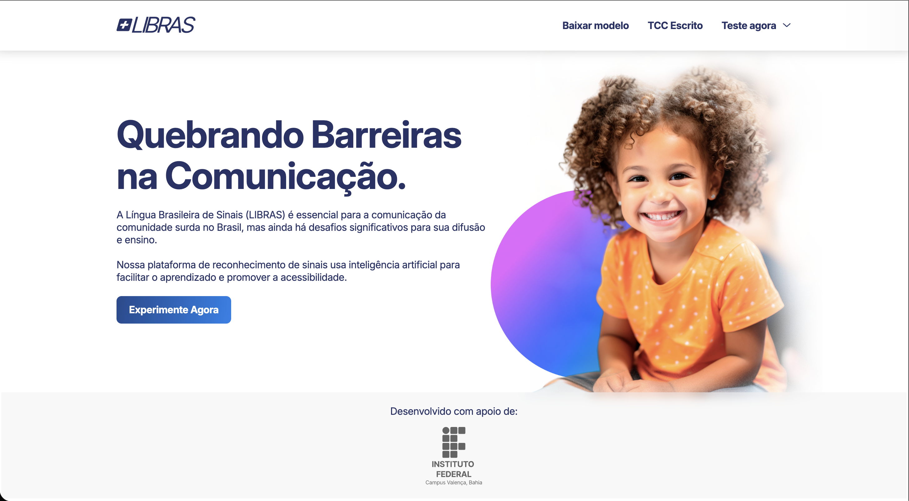

# +Libras 🤟

Sistema inteligente de reconhecimento de sinais em LIBRAS (Língua Brasileira de Sinais), desenvolvido com foco em acessibilidade, inclusão e apoio pedagógico em ambientes educacionais.

---

## 📸 Preview


<p align="center" style="display:flex; flex-direction:row; gap: 20px; width: calc(100% - 20px)">
  
  
</p>

---

## 📌 Sobre o Projeto

O **+Libras** é uma aplicação que utiliza **Visão Computacional** e **Inteligência Artificial** para identificar sinais em LIBRAS em tempo real através da webcam.

O projeto surge como uma solução para auxiliar no ensino e aprendizado da língua de sinais, promovendo inclusão e facilitando a comunicação entre pessoas surdas e ouvintes no ambiente educacional.

Este projeto foi desenvolvido como Trabalho de Conclusão de Curso (TCC) do curso técnico em informática do IFBA (Instituto Federal de Educação, Ciência e Tecnologia da Bahia).


> [!NOTE]
> O documento completo do Trabalho de Conclusão de Curso (TCC) está disponível em:
>
> 📄 [`Detecção de Letras - TCC.pdf`](docs/TCC-escrito.pdf)

---

## 📚 Contexto Acadêmico

Este projeto foi desenvolvido em equipe.

> [!IMPORTANT]
> Atuei como responsável pela aplicação web, sendo integralmente responsável por:

- 🎨 UI Design completo (estrutura, identidade visual e experiência do usuário)
- 🌐 Desenvolvimento da Landing Page
- 💻 Implementação da aplicação web com Python/Django
- 🤟 Desenvolvimento da funcionalidade de reconhecimento de gestos para formação de palavras

---

## 🎯 Objetivo

Desenvolver uma ferramenta capaz de:

- Reconhecer sinais estáticos em LIBRAS em tempo real
- Auxiliar professores e alunos no processo de aprendizagem
- Promover acessibilidade e inclusão
- Aplicar conceitos de IA em um contexto social relevante

---

## ⚙️ Como Funciona

1. A webcam captura os movimentos das mãos do usuário  
2. O MediaPipe identifica pontos-chave (landmarks) das mãos  
3. Os dados são processados e enviados para o modelo de IA  
4. O modelo realiza a previsão do sinal em LIBRAS  
5. O resultado é exibido em tempo real na interface  

---

## 🚀 Tecnologias Utilizadas

### 🧠 Inteligência Artificial
- Python  
- TensorFlow  
- Keras  
- NumPy  

### 👁️ Visão Computacional
- OpenCV  
- MediaPipe  

### 🌐 Web
- Django  
- HTML / CSS / JavaScript
- GSAP (GreenSock Animation Platform) — transições suaves no scroll

---

## 🧠 Modelo de IA

Diferente de muitas soluções, o modelo utilizado no +Libras foi:

- Treinado **do zero**  
- Utilizando dados coletados pela equipe  
- Validado com sinais reais de LIBRAS  

📁 Arquivo do modelo:
```
webcam/tcc_info_2025.task
```

---

## 📈 Possíveis Melhorias

- Reconhecimento de gestos em movimento  
- Expansão do vocabulário de sinais  
- Treinamento com mais usuários  
- Versão mobile  
- API para integração com outras plataformas  
- Interface mais interativa  

---

## 👤 Autor

**José Henrique**  
Designer & Desenvolvedor Web